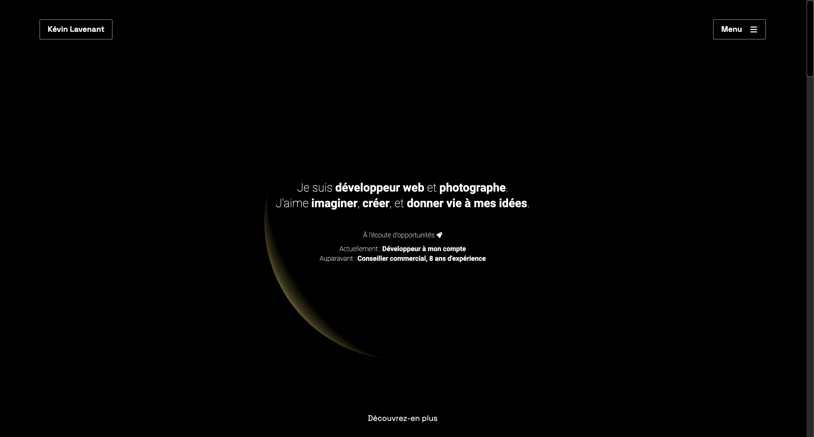

# Hello, I'm Kévin 👋

## 🌟 About Me

I am a web developer who transitioned from a commercial background. I completed a training program at La Manu in Amiens.
Creative and passionate, I chose to become a web developer to bring my ideas to life and help my clients achieve their most beautiful projects. 💡 
I am looking for an apprenticeship position to continue my studies or a full-time position.

## 📫 Contact Me

- **Email**: [kevin.lavenant@live.fr](mailto:kevin.lavenant@live.fr)
- **LinkedIn**: [Kevin Lavenant](https://www.linkedin.com/in/kevin-lavenant/)

## 🚀 Skills

|                                                                                                              |                                                                                                                   |                                                                                                                               |
| ------------------------------------------------------------------------------------------------------------ | ----------------------------------------------------------------------------------------------------------------- | ----------------------------------------------------------------------------------------------------------------------------- |
|                    |                            |                      |
|                    |                   |                            |
|                  |                               |                               |
|        |  |                         |
|                 |                         |                                  |
|  |       |  |

## 🌟 Key Projects

### [My Portfolio - kevin-lavenant.fr](https://kevin-lavenant.fr)

This is my personal portfolio, showcasing my web development skills and featuring my latest projects. Built with **Next.js**, **Symfony**, and **Three.js**, the site highlights interactive elements and animations, with a focus on responsiveness. My portfolio is hosted on a VPS for optimized performance and scalability, allowing me to demonstrate a professional-grade deployment environment.

## 💼 Professional Experience

- **Self-Employed**, Web Developer
  - As a self-employed web developer, I continuously create projects to further my self-education and to develop websites for my clients.
  - My projects often include creative design, animations, and secure, functional systems.
  - I enjoy the challenge of learning new technologies and applying them to meet my clients' needs. 🚀

<!-- ## 📊 GitHub Stats:

 -->

## 🎨 Other Interests

When I’m not coding, I enjoy taking portraits and landscape photographs. Staying active is important to me, so I regularly participate in 10km races and also enjoy rock climbing. 🧗‍♂️🏃

---

Thank you for visiting my profile! If you want to collaborate or just chat, feel free to contact me. 😊
